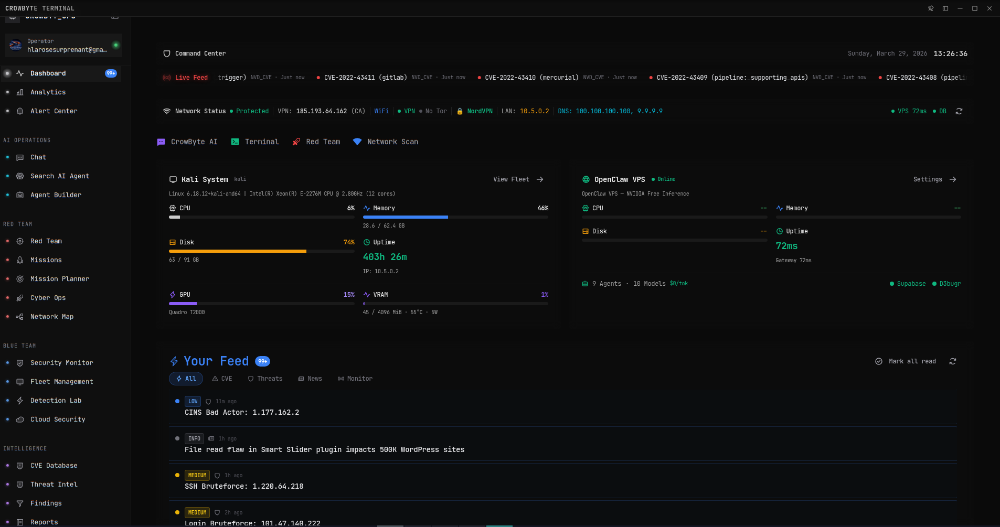

  <strong>AI-powered command center for offensive security.</strong> 
  Recon. Exploit. Report. One terminal.

  
  
  
  
  
  
  

---

## What is CrowByte?

CrowByte Terminal is a **desktop application** for penetration testers, bug bounty hunters, and red team operators. It replaces the workflow of juggling 20+ browser tabs, terminal windows, and note apps with a unified command center powered by AI.

Available for **Linux**, **Windows**, and **macOS**. Server appliance mode for browser-based access.

  

---

## Core Features

### AI Agent Swarm
Deploy up to 9 specialized AI agents on your own infrastructure. Agents handle reconnaissance, vulnerability analysis, exploit research, and report generation in parallel. Supports multiple LLM providers — bring your own API keys or use the built-in gateway.

### Mission Pipeline
Phase-based operation planning from scope import through exploitation to final report. Define objectives, track task dependencies, and automate status transitions across the entire engagement lifecycle.

### CVE Intelligence
Real-time vulnerability database with CVSS scoring, exploit status tracking, product correlation, and cross-referencing with Shodan. Search, filter, and bookmark CVEs relevant to your active engagements.

### Integrated Terminal
Full xterm.js terminal with tmux session management. Run Nmap, Nuclei, SQLMap, FFUF, or any CLI tool without leaving the platform. Output is automatically captured for report evidence.

### Fleet Management
Monitor endpoints, VPS nodes, and containers from a single dashboard. Real-time hardware metrics (CPU, RAM, disk, network), process inspection, and remote agent deployment. Built-in remote desktop with E2E encryption.

### Automated Reporting
Generate professional reports formatted for HackerOne, Bugcrowd, or custom templates. Findings are automatically populated with severity, evidence, reproduction steps, and impact analysis.

### Detection Rule Lab
Author, test, and manage detection rules across formats:
- **SIGMA** rules for SIEM correlation
- **KQL** queries for Azure Sentinel / Elastic
- **YARA** rules for malware analysis
- **Snort / Suricata** signatures for network detection

### Alert Center (SIEM Bridge)
Connect to your existing SIEM infrastructure. Pre-built connectors for Splunk, Elasticsearch, and custom sources. Real-time alert ingestion, triage, and correlation with your findings.

### Knowledge Base
Searchable research database for techniques, tool notes, methodology references, and engagement intelligence. Tag, categorize, and attach files. Full-text search across all entries.

### Cloud Security Posture
CSPM scanning, SBOM generation, and compliance checks across AWS, GCP, and Azure. Identify misconfigurations, exposed resources, and policy violations.

---

## AI Infrastructure

CrowByte supports multiple AI providers. Enterprise users can route all operations through their own infrastructure.

| Provider | Type | Notes |
|----------|------|-------|
| **Built-in Gateway** | OpenAI-compatible | Zero-cost inference via bundled VPS proxy |
| **OpenAI / Azure** | API | GPT-4o, GPT-4 Turbo |
| **Anthropic** | API | Claude Opus 4.6, Sonnet 4.6, Haiku 4.5 |
| **Self-hosted** | Ollama / vLLM | Any model on your hardware |
| **Custom** | OpenAI-compatible | Any endpoint that speaks the OpenAI API |

All AI features work offline with self-hosted models. No data leaves your machine unless you configure an external provider.

---

## Security

CrowByte is built with security-first principles. Your data stays yours.

- **E2E Encryption** — Remote desktop and fleet communication uses X25519 ECDH key exchange with AES-256-GCM. Zero-knowledge relay.
- **Local-First** — All data is stored locally in SQLite and Supabase (self-hostable). No telemetry, no tracking, no phone-home.
- **Credential Isolation** — API keys and secrets are stored in encrypted storage with device-bound keys. Never transmitted to third parties.
- **Audit Logging** — Every significant action is logged with timestamps and user attribution. Exportable for compliance.
- **No Source Exposure** — Proprietary codebase. Binary distribution only. No source code in the repository.

### Vulnerability Disclosure

If you discover a security vulnerability, report it responsibly.

**Email**: [security@hlsitech.io](mailto:security@hlsitech.io)

Do **not** open a public GitHub issue for security vulnerabilities.

See [SECURITY.md](SECURITY.md) for our full disclosure policy and response SLA.

---

## Screenshots

  
  

  
  

  
  

---

## Download

Get CrowByte Terminal for your platform:

| Platform | Format | Link |
|----------|--------|------|
| **Linux** | AppImage, .deb | [Download](https://crowbyte.io/download) |
| **Windows** | Installer (.exe) | [Download](https://crowbyte.io/download) |
| **macOS** | .dmg | [Download](https://crowbyte.io/download) |

Or visit [crowbyte.io/download](https://crowbyte.io/download) for the latest release.

---

## Tech Stack

| Layer | Technology |
|-------|-----------|
| Desktop | Electron 39 |
| Frontend | React 18, TypeScript 5, Vite |
| UI | Radix UI (shadcn/ui), Tailwind CSS, Framer Motion |
| Terminal | xterm.js + node-pty |
| Backend | Supabase (PostgreSQL, Auth, Storage, Edge Functions) |
| AI | Multi-provider (OpenAI-compatible, Anthropic, Ollama) |
| Charts | Recharts |
| Security | AES-256-GCM, X25519 ECDH, HKDF |

---

## Pricing

| Tier | Price | Includes |
|------|-------|----------|
| **Free** | $0 | Core features, 1 device, community support |
| **Pro** | $19/mo | All features, 3 devices, AI agents, priority support |
| **Team** | $49/mo | 10 seats, shared findings, fleet management |
| **Enterprise** | Custom | Unlimited seats, custom AI infra, dedicated support, SLA |

Visit [crowbyte.io](https://crowbyte.io) for details.

---

## Roadmap

- [ ] Plugin marketplace for community extensions
- [ ] Collaborative real-time editing for team engagements
- [ ] Mobile companion app (iOS / Android)
- [ ] API access for CI/CD pipeline integration
- [ ] Custom AI agent builder with drag-and-drop workflows

---

## License

**Proprietary Software** — HLSITech Inc. All rights reserved.

This repository contains documentation, legal documents, and release binaries only. The source code is not included and is not open source. Unauthorized copying, modification, distribution, or reverse engineering is strictly prohibited.

| Document | Link |
|----------|------|
| End User License Agreement | [EULA](legal/EULA.md) |
| Terms of Service | [legal/TERMS_OF_SERVICE.md](legal/TERMS_OF_SERVICE.md) |
| Privacy Policy | [legal/PRIVACY_POLICY.md](legal/PRIVACY_POLICY.md) |
| Acceptable Use Policy | [legal/ACCEPTABLE_USE_POLICY.md](legal/ACCEPTABLE_USE_POLICY.md) |

---

## Contact

| Channel | Address |
|---------|---------|
| Website | [crowbyte.io](https://crowbyte.io) |
| Support | [support@crowbyte.io](mailto:support@crowbyte.io) |
| Security | [security@hlsitech.io](mailto:security@hlsitech.io) |
| Company | [hlsitech.io](https://hlsitech.io) |

---

  Built by <a href="https://hlsitech.io">HLSITech</a> — Offensive security, powered by AI.

