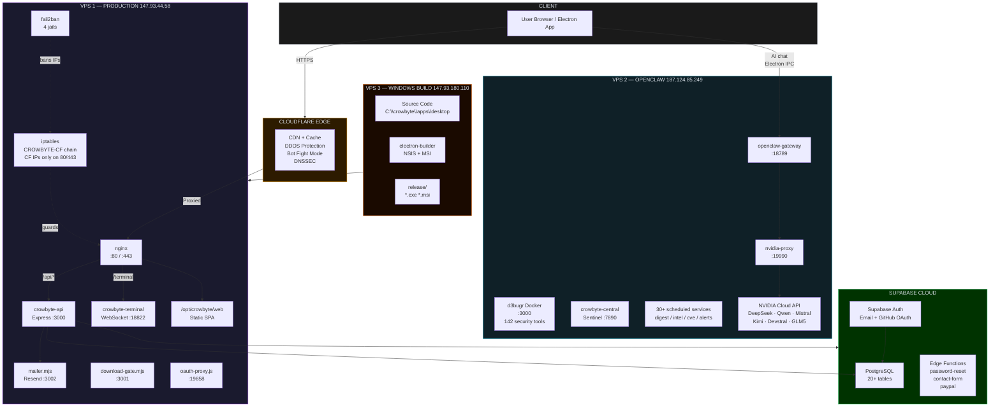
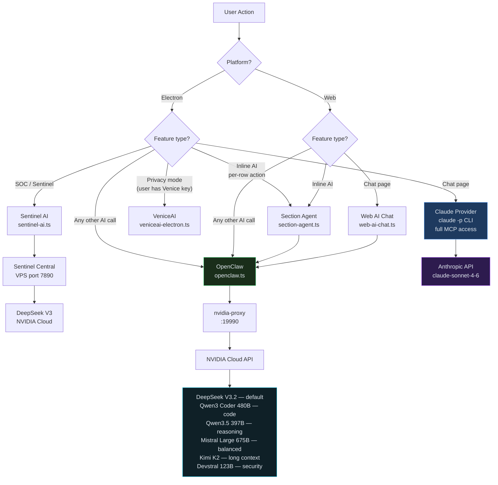
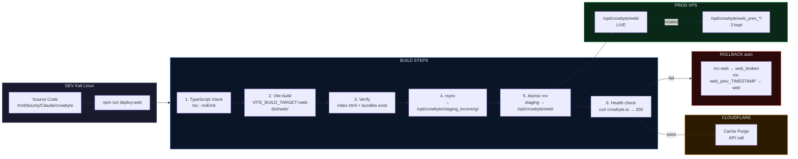
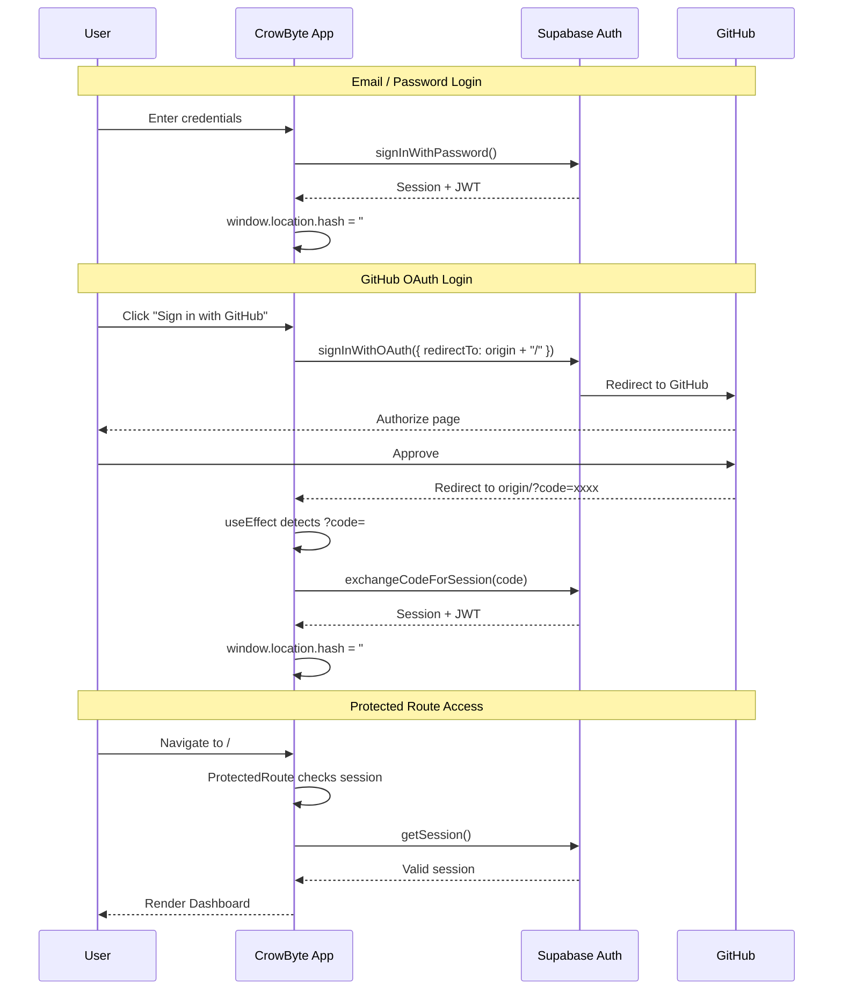
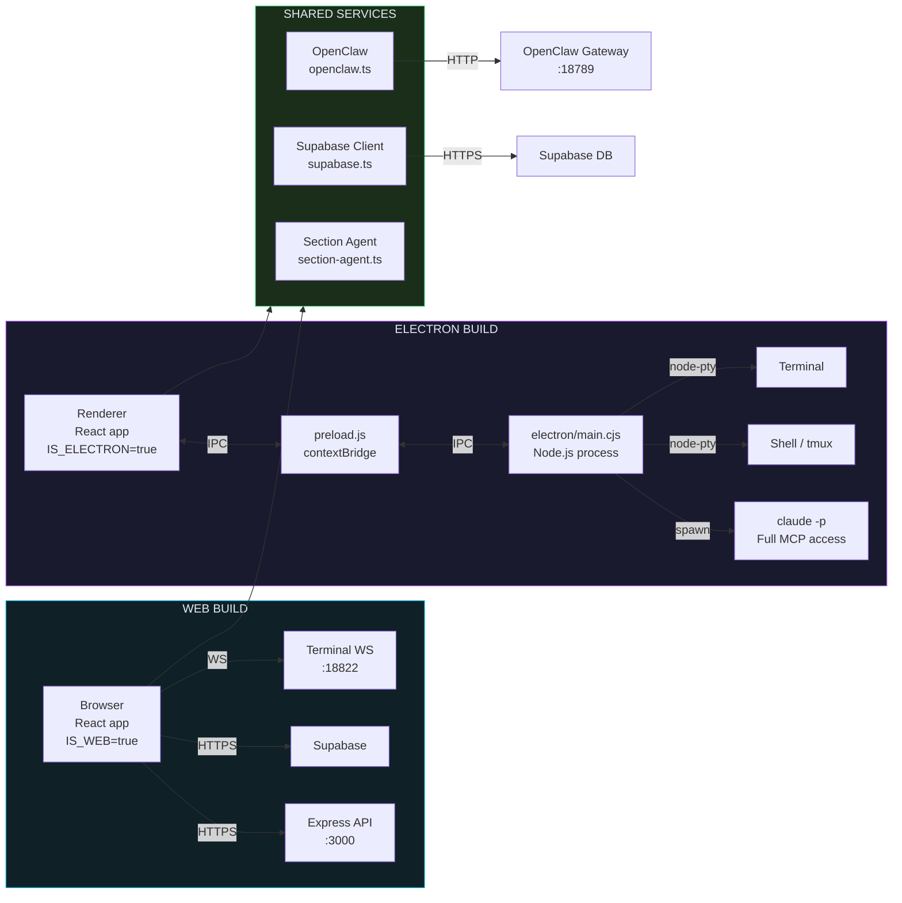
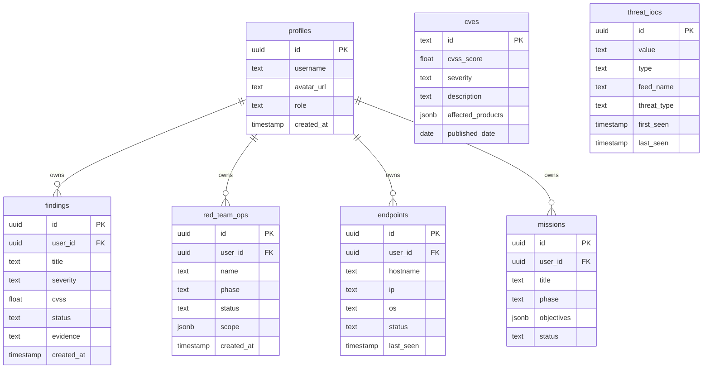
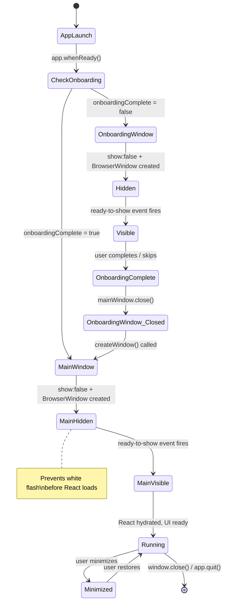

# CrowByte — Architecture Diagrams

---

## 1. Infrastructure Topology

---

## 2. AI Routing

---

## 3. Deploy Pipeline

---

## 4. Security Layers

```mermaid
flowchart TB
    ATK["Attacker / Bot / Scanner"]

    ATK --> L1

    subgraph L1["LAYER 1 — Cloudflare Edge"]
        CF1["DDoS protection"]
        CF2["Bot Fight Mode"]
        CF3["IP reputation"]
        CF4["Cache (assets/fonts 30d)"]
    end

    L1 --> L2

    subgraph L2["LAYER 2 — iptables  CROWBYTE-CF chain"]
        IP1["Only Cloudflare IPs\nallowed on :80/:443"]
        IP2["Tailscale 100.0.0.0/8\nalways allowed"]
        IP3["Everything else → DROP"]
    end

    L2 --> L3

    subgraph L3["LAYER 3 — nginx"]
        N1["Security headers\nHSTS · CSP · X-Frame"]
        N2["Canary endpoints\n/.env /.git /admin *.php\n→ 200 fake content + log"]
        N3["Rate limiting\n20 req/min /api/errors"]
    end

    L3 --> L4

    subgraph L4["LAYER 4 — fail2ban"]
        F1["crowbyte-canary\n1 hit → 30d ban"]
        F2["crowbyte-bots\n2 hits/1h → 30d ban"]
        F3["crowbyte-auth\n10 fails/60s → 7d ban"]
        F4["nginx-4xx\n20 errors/60s → 24h ban"]
    end

    L4 --> L5

    subgraph L5["LAYER 5 — App"]
        A1["Auth (Supabase JWT)"]
        A2["RLS on all tables"]
        A3["Service key Electron only"]
    end

    style L1 fill:#2d1b00,stroke:#f59e0b,color:#e2e8f0
    style L2 fill:#2d0a0a,stroke:#ef4444,color:#e2e8f0
    style L3 fill:#1a2e1a,stroke:#22c55e,color:#e2e8f0
    style L4 fill:#1a1a2e,stroke:#a855f7,color:#e2e8f0
    style L5 fill:#0f2027,stroke:#06b6d4,color:#e2e8f0
```

---

## 5. Auth Flow

---

## 6. Data Flow — Electron vs Web

---

## 7. Database Schema (Key Tables)

---

## 8. Electron Window Lifecycle

